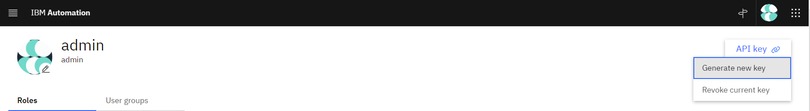

# Getting Started with LMCTL

# Prepare Python 3

LMCTL requires <a href="https://www.python.org" target="_blank">Python 3.6+</a>.

> Currently, testing is performed on versions 3.6, 3.7, 3.8 and 3.9.

On Ubuntu, you can use the following:

```
sudo apt update
sudo apt install software-properties-common
sudo add-apt-repository ppa:deadsnakes/ppa
sudo apt install python3.9
python3.9 --version
```

For other operating systems, follow the relevant <a href="https://www.python.org/downloads/" target="_blank">installation instructions</a>

We recommend installing <a href="https://virtualenv.pypa.io/en/latest/" target="_blank">Virtualenv</a> and creating an isolated environment for LMCTL:

```
python3 -m pip install virtualenv
python3 -m virtualenv lmctl-env
```

This will create an environment in a directory named `lmctl-env` (change the name to a value of your choosing). Once created, the virtual environment can be activated anytime with:

```
source lmctl-env/bin/activate
```

On Windows, try:

```
lmctl-env\Scripts\activate.bat
```

Ensure the environment is active anytime you install or use LMCTL to maintain isolation from your global Python environment.

To deactivate the virtual environment at anytime just execute:

```
deactivate
```

Why use a virtual environment?

- keeps all dependencies used by LMCTL isolated from other Python applications on your machine
- allow you to have alternate versions installed, in two separate environments, which is useful when there is a new major version of TNCO and LMCTL, with potential non-backward compatible changes

# Install LMCTL

Activate a virtual environment if you intend to use one, then install LMCTL with pip:

```
python3 -m pip install lmctl
```

To install a specific version <a href="https://pypi.org/project/lmctl/" target="_blank">see available versions</a>, add the number to the end of the command with `==`:

```
python3 -m pip install lmctl==3.0.0
```

Verify the installation has worked by executing:

```
lmctl --version
```

Access the `help` section of LMCTL with:

```
lmctl --help
```

# Configure Access 

LMCTL requires credentials to access the orchestration component of your Cloud Pak for Network Automation (CP4NA) environment. 

The most efficient method of configuring LMCTL is to use the `lmctl login` command with the access credentials of your environment.

This command will perform the following:

- Authenticate and obtain an access token for the target environment using the provided credentials
- Create an LMCTL configuration file at `~/.lmctl/config.yaml`, if one does not already exist
- Save the environments address(es) and access token to this configuration file with an environment name of `default` or a name of your choosing.
- Make this environment the "active" choice, which makes it the default used on most commands

> Check out the [login command documentation](command-reference/login.md) to view more detailed information about this command.

The credentials necessary for access depend on the configuration and version of the target environment.

- [Getting Started with LMCTL](#getting-started-with-lmctl)
- [Prepare Python 3](#prepare-python-3)
- [Install LMCTL](#install-lmctl)
- [Configure Access](#configure-access)
  - [Login to Cloud Pak for Network Automation](#login-to-cloud-pak-for-network-automation)
  - [Login to other environments](#login-to-other-environments)
  - [Multiple Environments](#multiple-environments)
  - [Next Steps](#next-steps)

## Login to Cloud Pak for Network Automation

You will need the address of the API gateway (Ishtar Route) for your environment. On most OCP installations, this can be retrieved with:

```
API_GATEWAY=https://$(oc get route cp4na-o-ishtar -o jsonpath='{.spec.host}')
```

You will also need the Cloud Pak front door address. On most OCP installations, this can be retrieved with:

```
CP_FRONT_DOOR=$(oc get orchestration default -o jsonpath='{.status.uiendpoints.orchestration}')
```

You'll also need to obtain an API key for your Cloud Pak user. This can retrieved by visiting the CP4NA graphical user interface (`CP_FRONT_DOOR`) and logging in with with your username and password.

Access `Profile and Settings` from the user menu icon located in the top right section of the navigation header. From the profile page you can generate your API key by clicking on the `API Key` link in the top right and then `Generate new key`. 



You may be warned that generating a new key will invalidate any previous keys. Either use your existing key (if known) or click `Generate` to create a new one. Make a copy of this key and use it to login with lmctl:

```
lmctl login $API_GATEWAY --zen --auth-address $CP_FRONT_DOOR --username your-username 
```

You will be prompted for your API key. Enter your key and hit enter. As the API key is a sensitive value, it will be hidden from the command line:

```
API Key []: 
```

> Note: if you need to login from an environment which cannot support prompts then the API key can be provided with the `--api-key` option instead. Note, caution is advised as this may make the API key visible in your command history.

You should see output similar to:

```
Login success
Updating config at: /home/myuser/.lmctl/config.yaml
```

You can test access is ready using `ping`:

```
lmctl ping env
```

If the output of this command ends with `CP4NA orchestration tests passed! ✅` then you're ready to go. 

Eventually your access token will expire, resulting in authentication errors when using lmctl. When this occurs, run `login` again to reauthenticate.

## Login to other environments

If your environment is not a Cloud Pak instance then you may need to use an [alternative authentication mechanism](auth-modes/index.md).

## Multiple Environments 

You may login in to more than one environment at any one time. Just run `login` again but include the `--name` option, otherwise the environment will be saved with the same default value as the first. 

```
lmctl login DEV_API_GATEWAY --auth-address DEV_UI_ADDRESS --username almadmin --password password --name dev
lmctl login TEST_API_GATEWAY --auth-address TEST_UI_ADDRESS --username almadmin --password password --name test
lmctl login PROD_API_GATEWAY --auth-address PROD_UI_ADDRESS --username almadmin --password password --name prod
```

Only one environment is considered "active", which makes it the default. However, most commands allow you to specify an environment by name. Run the following commands and check out the address reported in the output:

```
# Ping dev
lmctl ping env dev

# Ping test
lmctl ping env test

# Ping prod
lmctl ping env prod

# Ping active env (last logged in)
lmctl ping env
```

You can switch the active environment at any time with `lmctl use`:

```
lmctl use env dev

# Ping active env (will use "dev")
lmctl ping env
```

## Next Steps

You can read more about the configuration options available with LMCTL in the [configure](configure.md) section of this documentation.

To learn more about creating Assembly/Resource projects, including how to integrate a project with an existing Assembly you have developed using the designer user interface, check out the [projects](projects/overview.md) section of this documentation.

Otherwise, check out the [Command Reference](command-reference/index.md) to learn more about the commands LMCTL provides.
